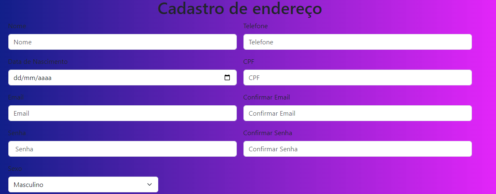
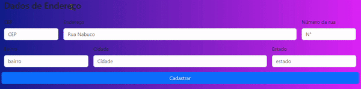

## Introdução e funcionalidades
A tela de cadastro foi aprimorada em relação às versões anteriores. Agora, o campo de CEP é preenchido automaticamente ao ser inserido. Além disso, foi adicionado um novo campo o de endereço, com base no estudo de outras telas de cadastro. Essas melhorias tornam o cadastro mais rápido e fácil.

Parte 1

Parte 2(cep)

## Informações de Cadastro (Spotify, Instagram, Amazon)

Estas são as informações necessárias e opcionais retiradas dos processos de cadastro do Spotify, Instagram e Amazon:
Nome Completo: Necessário em todas as plataformas.

E-mail: Essencial para identificação e notificações em todas as plataformas.

Senha: Deve ser segura, seguindo requisitos específicos, em todas as plataformas.

Data de Nascimento: Opcional para verificar a idade em todas as plataformas.

País e Idioma: Opcionais, utilizados para personalização no Spotify.(não foi preciso para a minha aplicação)

Nome de Usuário: Exclusivo apenas para o Instagram.(não foi preciso para a aplicação)

Número de Telefone: Opcional, para verificação de identidade exclusivamente no Instagram.

Endereço: Essencial para envio de produtos, presente somente na Amazon.

Sexo: Opcional, para personalização de anúncios apenas na Amazon.

Foto do Perfil: Opcional, utilizada para identificação em todas as plataformas.

Biografia/Descrição: Informações adicionais sobre o usuário, opcionais em todas as plataformas.

Interesses e Preferências de Conteúdo: Opcionais, para recomendação de conteúdo personalizado em todas as plataformas.

Observação: Requisitos específicos podem variar conforme a região e os termos de uso de cada plataforma. Recomenda-se revisar as políticas de privacidade e os termos de cada empresa para entender o uso das informações fornecidas.

## Mas qual o motivo para essas informações serem exencias para a aplicação?
simples pelo engajamento dentro das plataformas e após a criação de algoritmos essas informações pedidas como idade pais e sexo são todas para oferecer uma melhor experiência dentro desses mesmos aplicativos, tambem para poder identificação dos usuarios.
## Colaboradores
[**Miguel Silva LSuciano**](https://github.com/miguelitto16)
## Tecnologias ultilizadas

 • **Github**
 
 • **Viacep**

 • **VScode**
 
 • **bootstrap5.0**
    
 • **HTML5**

 • **Javascript3**
